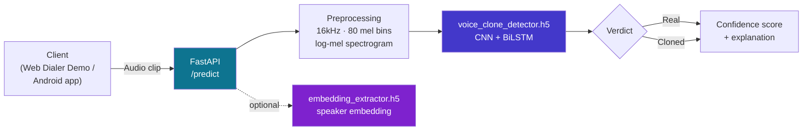

<div align="center">

# ⚙️ VoxSentry Backend

### FastAPI Inference Service for Real-Time Voice Clone Detection

**Serves the CNN+BiLSTM spoof-detection model that powers the VoxSentry web demo and Android app.**

Part of **VoxSentry** — built for **Smart India Hackathon 2026** · Problem Statement **SIH26104**

[](https://fastapi.tiangolo.com/)
[](https://www.python.org/)
[](https://www.tensorflow.org/)
[](https://www.docker.com/)
[](https://render.com)

[](https://github.com/vineetm1204-m/voxsentry-backend/stargazers)
[](https://github.com/vineetm1204-m/voxsentry-backend/network/members)
[](https://github.com/vineetm1204-m/voxsentry-backend/commits/master)
[](#-roadmap)

<br/>

<a href="#-quick-start"><strong>Quick Start »</strong></a>
·
<a href="#-api-reference">API Reference</a>
·
<a href="#-deployment">Deployment</a>
·
<a href="#-related-repositories">Related Repos</a>

</div>

<br/>

> [!NOTE]
> This service is one of three VoxSentry repositories. It has no UI of its own — pair it with [`voxsentry-web`](https://github.com/vineetm1204-m/voxsentry-web) (frontend + live demo) or the Android app for a working end-to-end system. See [Related Repositories](#-related-repositories).

---

## 📑 Table of Contents

<details open>
<summary>Click to expand</summary>

- [Overview](#-overview)
- [How It Works](#-how-it-works)
- [Quick Start](#-quick-start)
  - [Prerequisites](#prerequisites)
  - [Install & Configure](#install--configure)
  - [Run the Server](#run-the-server)
- [Model Files](#-model-files)
- [Environment Variables](#-environment-variables)
- [API Reference](#-api-reference)
- [Project Structure](#-project-structure)
- [Deployment](#-deployment)
  - [Option A — Render / Railway](#option-a--render--railway-recommended-for-demo)
  - [Option B — Docker on a VPS](#option-b--docker-on-a-vps)
  - [Handling Large Model Files](#handling-large-model-files)
- [Roadmap](#-roadmap)
- [Related Repositories](#-related-repositories)
- [License](#-license)

</details>

---

## 🔍 Overview

**`voxsentry-backend`** is the machine-learning inference layer of VoxSentry. It loads a trained **CNN+BiLSTM** spoof-detection model and exposes it over a REST API, so that both the web Dialer Demo and the Android app can send audio and get back a **real vs. cloned** verdict with a confidence score — without either client needing to run TensorFlow themselves.

| Component | Repo | Role |
|---|---|---|
| ⚙️ **ML backend** *(this repo)* | `voxsentry-backend` | FastAPI service serving the CNN+BiLSTM spoof-detection model |
| 🌐 **Web app** | [`voxsentry-web`](https://github.com/vineetm1204-m/voxsentry-web) | Marketing site + live in-browser Dialer Demo + APK download |
| 📱 **Android app** | `voxsentry-app` | Real-time call protection via a floating overlay bubble |

---

## 🧠 How It Works



The API accepts an audio clip, runs it through the locked preprocessing pipeline, and returns a verdict. The `embedding_extractor` model supports voice-enrollment/identity-matching features on the roadmap.

---

## ⚡ Quick Start

### Prerequisites

- Python 3.10+
- Trained `.h5` model files (see [Model Files](#-model-files))

### Install & Configure

```bash
git clone https://github.com/vineetm1204-m/voxsentry-backend.git
cd voxsentry-backend

pip install -r requirements.txt

cp .env.example .env
# edit .env with your model paths and thresholds
```

### Run the Server

```bash
uvicorn app.main:app --reload --port 8000
```

The server starts on `http://localhost:8000`. Check it's alive at:

```
GET http://localhost:8000/health
```

---

## 🗂️ Model Files

The backend expects two trained `.h5` models (exported from Kaggle/Colab notebooks) placed in `models/`:

| File | Purpose |
|---|---|
| `models/voice_clone_detector.h5` | Primary CNN+BiLSTM spoof/clone classifier |
| `models/embedding_extractor.h5` | Speaker embedding model (voice enrollment / identity matching) |

> [!IMPORTANT]
> These model files are **not bundled in this repo** by default due to GitHub's 100MB file-size limit — see [Handling Large Model Files](#handling-large-model-files) before deploying.

---

## 🔑 Environment Variables

Configured via `.env` (copy from `.env.example`):

| Variable | Description |
|---|---|
| `MODEL_PATH` | Path to `voice_clone_detector.h5` |
| `EMBEDDING_MODEL_PATH` | Path to `embedding_extractor.h5` |
| `FRONTEND_URL` | Deployed frontend URL, for CORS (e.g. `https://voxsentry-web.vercel.app`) |

---

## 📡 API Reference

<details open>
<summary><strong>GET</strong> <code>/health</code> — service health check</summary>
<br/>

Returns service status. Useful for uptime checks and confirming the model loaded correctly on boot.

```bash
curl http://localhost:8000/health
```

</details>

<details>
<summary><strong>POST</strong> <code>/predict</code> — classify an audio clip <em>(see app/ for exact route + schema)</em></summary>
<br/>

Accepts an audio file and returns a real/cloned verdict with a confidence score. Exact request/response schema is defined in `app/main.py` — check there for the current field names before integrating.

```bash
curl -X POST http://localhost:8000/predict \
  -F "file=@dummy.wav"
```

</details>

> [!TIP]
> `dummy.wav` in the repo root is handy for a quick smoke test against either endpoint.

---

## 📁 Project Structure

```
voxsentry-backend/
├── app/            # FastAPI application (routes, inference logic)
├── models/         # .h5 model files (not committed — see Model Files)
├── Dockerfile      # Container build for VPS/Docker deployment
├── render.yaml     # One-click deploy config for Render
├── requirements.txt
└── dummy.wav        # Sample clip for smoke-testing the API
```

---

## 🚀 Deployment

### Option A — Render / Railway *(recommended for demo)*

This repo ships a `render.yaml` for one-click deployment:

1. Push this repository to GitHub.
2. In the [Render dashboard](https://render.com), create a new **Web Service** connected to this repo — it auto-detects `render.yaml`.
3. Set the required environment variables in the dashboard:
   - `MODEL_PATH` → e.g. `models/voice_clone_detector.h5`
   - `EMBEDDING_MODEL_PATH` → e.g. `models/embedding_extractor.h5`
   - `FRONTEND_URL` → your deployed frontend (e.g. `https://voxsentry-web.vercel.app`)

### Option B — Docker on a VPS

The included `Dockerfile` supports a self-managed deployment (e.g. a Vultr VPS behind Nginx + Certbot SSL):

```bash
docker build -t voxsentry-backend .
docker run -d -p 8000:8000 --env-file .env voxsentry-backend
```

Pair with an Nginx reverse proxy and Certbot for TLS in production, and transfer model files to the server (e.g. via `scp`) before first boot.

### Handling Large Model Files

> [!WARNING]
> GitHub caps individual files at **100MB** unless you use Git LFS — `.h5` models frequently exceed this.

- **If your `.h5` files are under 100MB:** commit them directly into `models/`.
- **If they're larger:** use [Git LFS](https://git-lfs.github.com/), or modify the `render.yaml` / Docker build step to pull models from cloud storage (S3, GCS, or HuggingFace) at startup instead of committing them.

---

## 🗺️ Roadmap

- [x] `/health` endpoint
- [x] Core spoof/clone classifier serving via FastAPI
- [x] Render deployment config
- [ ] Wire up `/predict` fully to the web Dialer Demo (currently mockable on the frontend)
- [ ] Voice-enrollment embedding matching via `embedding_extractor.h5`
- [ ] Documented request/response schema in this README once the API stabilizes
- [ ] Production hardening: rate limiting, request validation, structured logging

---

## 🔗 Related Repositories

- 🌐 [`voxsentry-web`](https://github.com/vineetm1204-m/voxsentry-web) — Next.js marketing site + live demo
- ⚙️ **`voxsentry-backend`** *(this repo)* — FastAPI inference service (CNN+BiLSTM)
- 📱 `voxsentry-app` — React Native (Expo) Android app with real-time call overlay

---


**[⬆ back to top](#️-voxsentry-backend)**

</div>
